# A água no Sistema Terrestre  {#ciclohidro}

Objetivos de aprendizagem:

1. Descrever os principais reservatórios no ciclo hidrológico global e seus tamanhos relativos 

2. Descrever os principais fluxos conectando os reservatórios do ciclo hidrológico global

3. Descrever as propriedades da água relevantes para Hidrometeorologia

<!--
4. Converter massa, volume e fluxos de energia 

5. Aplicar a equação do balanço de massa a um volume de controle particular

6. Informar as taxas médias do ciclo hidrológico global e os tempos de residência da água nos diferentes reservatórios

7. Definir bacia hidrográfica e explicar sua relevância para Hidrometeorologia

8. Delinear uma bacia hidrográfica a partir de dados topográficos para uso em análises hidrológicas

-->

<!--
## Sistema Terrestre 

Na escala de tempo de curto prazo, o vapor d'água atmosférico interage com a circulação atmosférica e é crucial na formação das zonas climáticas da Terra que determinam as áreas habitáveis. Em escalas de centenas de milhões de anos, a água contribui para lubrificação e movimento das placas tectônicas, promovendo mudanças na forma da Terra.

O sistema terrestre pode ser visto como uma composição de diversas esferas que interagem entre si através de trocas de energia, água e dos ciclos biogeoquímicos. As principais componentes do sistema climático são descritas a seguir.

- Atmosfera (ar)

- Hidrosfera (água) 

- Criosfera (porções congeladas da Terra)

- Biosfera (organismos vivos)

- Pedosfera (solo)

- Antroposfera (humanos)

A componente humana é um importante agente de mudança ambiental através das mudanças do uso e cobertura da superfície terrestre que afetam diretamente componentes do ciclo hidrológico e dos ciclos biogeoquímicos. Diversos processos físicos, biológicos e químicos dentro do sistema terrestre geram *feedbacks* no sistema climático que acentuam ou mitigam mudanças no clima. Muitos desses *feedbacks* estão associados aos ecossistemas terrestres e as atividades humanas. Um entendimento mais abrangente sobre o clima da Terra requer que todas componentes do sistema climático (físicas, químicas, biológicas e sócio-econômicas) sejam consideradas. 

\BeginKnitrBlock{rmdtip}
Como leitura complementar sobre as esferas do sistema climático recomenda-se a leitura do [Capítulo 1](http://ead06.proj.ufsm.br/moodle/mod/resource/view.php?id=316666) do Livro *Terrestrial Hydrometeorology* (@Shuttle2012).
\EndKnitrBlock{rmdtip}
-->

## Ciclo Hidrológico

Uma forma útil de conceitualizar a Hidrometeorologia é através da representação simplificada do **ciclo hidrológico**, como mostrado na Figura \@ref(fig:cap2CicloHidro) e na Figura \@ref(fig:cap2CicloHidroAnim). O ciclo hidrológico é o movimento vertical e horizontal da água em suas diferentes fases (vapor, líquida ou sólida) entre a os oceanos, a atmosfera e a superfície terrestre (veja animação abaixo). Pode-se imaginar esse ciclo ocorrendo em diversas escalas espaciais (da local a global) temporais (minutos a décadas).

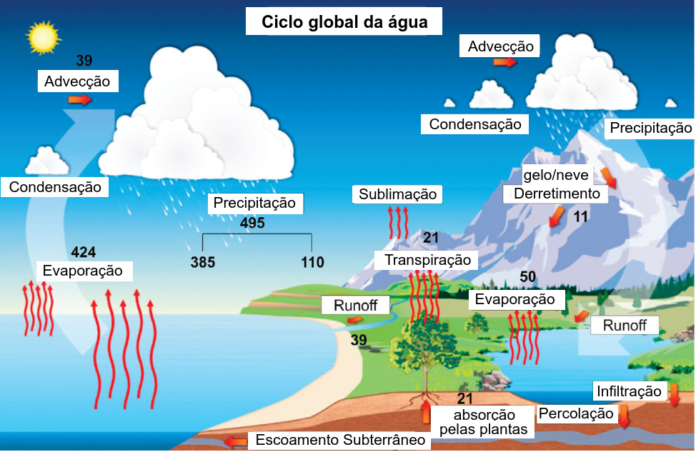

(\#fig:cap2CicloHidro)Ilustração conceitual do Ciclo Hidrológico. Fluxos expressos em 10^3^ km^3^

Alguns dos principais reservatórios hidrológicos são: a atmosfera, o solo e o subsolo, corpos d'água superficiais (ou seja, rios, lagos), a criosfera (incluindo neve sazonal, geleiras e calotas polares), a biosfera (por exemplo, água armazenada na vegetação) e os oceanos. Em todos os reservatórios, a água pode ser armazenada em qualquer uma de suas fases (água líquida, gelo e vapor d'água). Por exemplo, na atmosfera, a água pode existir nas três fases, enquanto a criosfera consiste principalmente de gelo. A água no solo e na superfície é principalmente líquida. 

(ref:cap2CicloHidroAnim) Animação conceitual do Ciclo Hidrológico. Fonte: https://www.nasa.gov/vision/earth/environment/warm_wetworld.html.

<!--html_preserve-->

<iframe src="https://www.youtube.com/embed/Az2xdNu0ZRk" width="533" height="300" frameborder="0" allowfullscreen=""></iframe>

<!--/html_preserve-->

(\#fig:cap2CicloHidroAnim)(ref:cap2CicloHidroAnim)

A água se move entre os vários reservatórios por meio de **fluxos**. Entre dos principais fluxos hidrológicos estão: a **precipitação** (na forma líquida ou sólida), **evaporação** e **transpiração** (juntas são referidas como **evapotranspiração**), **infiltração**, **recarga** (ou **percolação**) e **escoamento** (ou **runoff**). 

Os oceanos cobrem cerca de 70 % do planeta e formam a maior superfície evaporante do planeta. A água evapora dos oceanos e da superfície terrestre e se transforma em vapor d'água na atmosfera que é transportada horizontalmente pelos ventos (**advecção**) em direção aos continentes, sujeita ao efeito da [força de coriolis](https://translate.google.com/translate?sl=en&tl=pt&u=https://en.wikipedia.org/wiki/Coriolis_force). O vapor pode condensar formando nuvens e em condições atmosféricas apropriadas essa água precipita na terra e nos oceanos. A precipitação na forma de neve acumula-se na superfície, enquanto a chuva pode ser interceptada pela vegetação, infiltrar no solo ou escoar pelo solo como **escoamento sub-superficial** ou sobre a superfície como **escoamento superficial**. A água infiltrada pode percolar mais profundamente para recarregar os aquíferos subterrâneos que, em última análise, alimentam os corpos d'água superficiais (principalmente os rios) via e**scoamento subterâneo**. Os escoamento superficial e sub-superficial também contribuem para o fluxo de água nos rios (**Vazão**). Estes fluxos, controlados pela força gravitacional, retornam aos oceanos, a partir dos quais a água pode ser evaporar novamente, fechando o ciclo.

A água atmosférica (umidade do ar) é reabastecida por meio da evaporação do solo e de superfícies de água livre, além da transpiração da vegetação. Os fluxos e o armazenamento estão diretamente vinculados por meio do balanço de massa, conforme descrito em mais detalhes na seção \@ref(balhid). 

Um aspecto fundamental do ciclo hidrológico é o fato de ser impulsionado pela energia da radiação solar. Apesar do ciclo de energia ser um sistema aberto, a quantidade de água no sistema terrestre não muda (para escalas de tempo menores que a geológica) e o ciclo hidrológico é essencialmente fechado. Em outras palavras, não existem forçantes externas em termos de fluxo de água. Sistemas sem forçantes externas geralmente chegam a um estado de equilíbrio. Então, o que torna o ciclo hidrológico tão dinâmico? A entrada de radiação solar, externa ao sistema, impulsiona o ciclo hidrológico. Em média no globo, 342 W m^-2^ de energia solar radiativa é fornecida ao sistema no topo da atmosfera. Essa entrada de energia deve ser dissipada e isso é feito, em grande parte, por meio do ciclo hidrológico. Devido a este fato, a hidrometeorologia não se limita ao estudo do armazenamento e movimento da água, mas também de energia.

### Interação entre rios e oceanos

A região de encontro entre um rio e oceano é chamada de [estuário](https://pt.wikipedia.org/wiki/Estu%C3%A1rio), um importante tipo de ecossistema (Figura \@ref(fig:sealevel)). A descarga de água dos rios dilui água dos oceanos evitando torná-la mais salgada, o que por sua vez influencia o transporte de calor pelos oceanos e a variação do nível do mar[^7]. Os rios também carregam nutrientes para o oceano o que influencia a produtividade dos ecossistemas marinhos e o ciclo de carbono entre a atmosfera, a superfície terrestre e o oceano. Dessa forma, o ciclo de carbono está intimamente vinculado ao ciclo hidrológico.

[^7]: Como a água doce é naturalmente menos densa do que a água salgada, a vazão do rio flutua sobre a superfície do oceano e a força de Coriolis a força a girar acentuadamente ao longo da costa. A água doce forma uma corrente que empurra a água contra a costa, elevando o nível do mar localmente neste processo.

(ref:sealevel) Efeito da descarga de água doce no nível do mar. Fonte: [Woods Hole Oceanographic](http://www.whoi.edu/news-release/study-finds-link-between-river-outflow-and-coastal-sea-level).

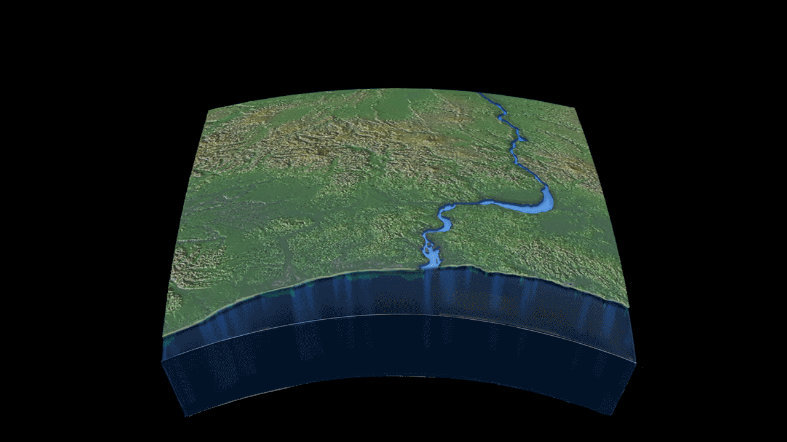

(\#fig:sealevel)(ref:sealevel)

## Distribuição global de água

A Hidrosfera envolve a água contida no planeta Terra armazenada em rios, lagos, oceanos, solo e ar. A Terra armazena $\approx$ 1377 milhões  de km^3^ de água (soma dos volumes de água doce e salgada da Tabela \@ref(tab:water-earth-table)). Comparado ao volume da Terra (1,08321 $\times$ 10^12^ km^3^), esse volume de água é $\approx$ 0,13% do volume do planeta (Figura \@ref(fig:wateravail)).

(ref:wateravail) Disponibilidade de água relativa ao volume da Terra. A esfera à esquerda representa a Terra com toda água removida. A esfera a diretira representa o volume de toda água da Terra. O pequeno ponto azul mais à direita representa a disponibilidade de água doce. Fonte: http://www.whoi.edu/page.do?pid=80696&i=7301

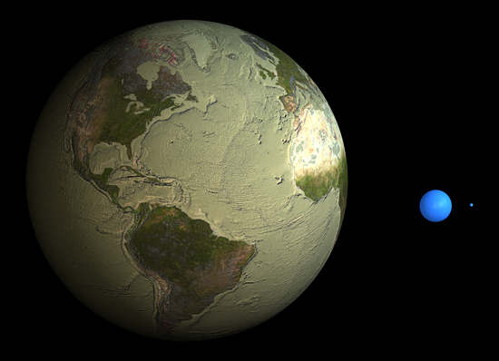

(\#fig:wateravail)(ref:wateravail)

O volume total de água espalhado sobre a área superficial da Terra ($\approx$ 510 milhões de km^2^) seria equivalente a uma lâmina de água de profundidade média de 2700 m.

A Tabela \@ref(tab:water-earth-table) mostra estimativas do volume de água armazenada nos principais reservatórios de água do sistema global. Conjuntamentamente, eles representam a Hidrosfera. Estas estimativas[^1] servem para dar uma noção da a ordem de magnitude de cada reservatório. 

Os oceanos são de longe o maior dos reservatórios (97% daquele volume total de água, Tabela \@ref(tab:water-earth-table)) e contém água salgada. 
<!-- 
Isto equivale a uma lâmina d'água de profundidade média de 3710 m espalhada sobre a área superficial dos oceanos ($\approx$ 360 milhões de km^2^). 
-->
O segundo maior reservatório refere-se as áreas de água congelada (calotas polares, geleiras, solo permanentemente congelado ([permafrost](https://pt.wikipedia.org/wiki/Pergelissolo)) que contêm principalmente água doce (62,8% do total água doce). Se toda esta reserva de água congelada fosse derretida, o que já acontenceu várias vezes na história da Terra, o nível do mar seria elevado uns 73  m.

<!-- 
Em geral a *água* é um termo usado para se referir a parte da água doce que é renovável anualmente e inclui a água superficial, a água no solo e no sub-solo. 
-->

Entre os reservatórios mais dinâmicos de água doce, a água subterrânea é o maior de todos (36,4 % do total de doce). Os aquíferos profundos armazenam maior parte deste volume de água subterrânea. As estimativas globais das reservas subterrâneas variam muito na literatura e são o termo de maior incerteza da Hidrosfera. Aproximadamente 1/3 da população mundial faz uso das reservas de água subterrânea para abastecimento doméstico e municipal. Entre os países altamente dependentes do abastecimento subterrâneo estão a Índia, com 85%, e os EUA (33%). 

A ínfima fração relativa do total de água doce restante (0,42 %)  corresponde a água contida no rios, lagos e áreas úmidas (pântanos, banhados, manguezais, áreas alagadas). Apesar da pouca disponibilidade desta fonte superficial de água, ela é mais usada pela população mundial devido ao fácil acesso e uso. A pequena fração de água armazenada por estes reservatórios pode subestimar a importância deles, uma vez que tendem a ser os mais dinâmicos do ciclo hidrológico. 

[^1]: Estas estimativas são aproximadas e diferentes fontes produzirão valores diferentes.

Table: (\#tab:water-earth-table)Água armazenada no planeta Terra. Adaptado de @Trenberth2007.

|Reservatório               | Volume (Km^3^)| Total de água (%)| Total de água doce (%)|
|:--------------------------|--------------:|-----------------:|----------------------:|
|Oceano                     |  1.335.040.000|            97,000|                     NA|
|Água doce                  |     41.984.700|             3,000|                     NA|
|Áreas congeladas           |     26.372.000|             1,900|                  62,80|
|Água subterrânea           |     15.300.000|             1,100|                  36,40|
|Lagos, Rios e áreas úmidas |        178.000|             0,013|                   0,42|
|Água no solo               |        122.000|             0,009|                   0,29|
|Atmosfera                  |         12.700|             0,001|                   0,03|

Em média 12.700 km^3^ (25 mm) de vapor d’água por ano existem na atmosfera. Para acomodar os 577.000 km^3^ de evaporação (veja seção \@ref(BHglobal)), o volume total de água contida na atmosfera deve ser reciclado (da atmosfera para superfície terrestre e oceano) mais de 40 vezes por ano ou $\approx$ 8 dias. Isto é conhecido como tempo de residência ou de renovação (visto em mais detalhes na seção \@ref(balhid)).

A umidade do solo é uma fração muito pequena da água doce, entretanto, a ela é determinante na partição de energia entre os fluxos do balanço de energia e consequentemente no clima regional próximo à superfície.

## Propriedades da água

<!--
A água é a substância mais abundante no planeta e é indispensável para vida na Terra. Aproximadamente 60% do tecido animal e 90% do tecido das plantas é constituído de água. 
-->

A importância da água no sistema terrestre decorre da peculiaridade de sua estrutura molecular. A natureza polar da água e os efeitos das pontes de Hidrogênio explicam a maioria das propriedades exclusivas da água, como: menor densidade na forma sólida, alto calor latente e capacidade térmica, coesão e adesão, alta viscosidade, tensão superficial, capacidade solvente, entre outras propriedades.

### Estrutura molecular da água

Na molécula de água 2 átomos de Hidrogênio são unidos a 1 de Oxigênio (H~2~O) por uma **ligação covalente** (Figura \@ref(fig:CH-estrutura-molec-agua)). Em particular, a H~2~O é polar de forma que o 'lado' do Hidrogênio tem carga positiva e o do Oxigênio tem carga positiva. Esta **polaridade** controla o arranjo das moléculas de água entre si na forma líquida e sólida. A extremidade positiva de uma molécula (átomo de Hidrogênio) é atraída pela extremidade negativa (átomo de oxigênio) de outra molécula através das **pontes de Hidrogênio**. 

(ref:CH-estrutura-molec-agua) Características especiais da estrutura intramolecular (a: ligações covalentes entre os átomos, b: polaridade de uma molécula de água) e intermolecular da água (c: Arranjo entre moléculas de água vizinhas devido as pontes de Hidrogênio). Adaptado de http://bioweb.uwlax.edu/bio203/2010/olson_moll/polarwatermoleculeGOOD.jpg.

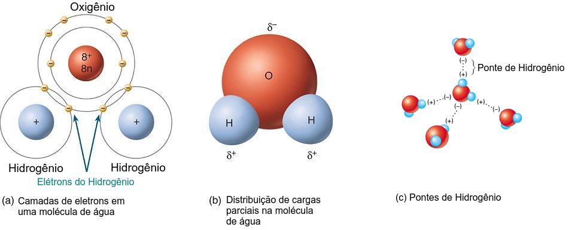

(\#fig:CH-estrutura-molec-agua)(ref:CH-estrutura-molec-agua)

### Mudanças de fase da água

A Figura \@ref(fig:CH-diag-fases-agua) mostra o diagrama termodinâmico de fases da água pura. De particular relevância é que as condições de pressão e temperatura da Terra no diagrama de fase estão localizadas em uma região em torno dos limites entre as três fases. E de fato, o sistema terrestre é o único em que a água existe nas suas 3 fases, gelo sólido, água líquida e vapor d'água, comparado as condições nos outros planetas. 

\BeginKnitrBlock{rmdtip}
O diagrama de fases da água define o domínio no espaço pressão-temperatura correspondente a uma fase particular da água, assim como os limites das transições entre as diferentes fases que envolvem troca de energia (calor latente, $\lambda$). As curvas representam condições de equilíbrio onde duas fases da água podem coexistir e a interseção de todas as três curvas é o **ponto triplo** (0,01 °C, 0,612 kPa). A curva de equilíbrio entre sólido e líquido representa **fusão (ou congelamento)**, a curva entre líquido e vapor representa **evaporação (ou condensação)** e a curva entre sólido e vapor representa **sublimação (ou deposição)**. As mudanças entre fases ocorrem a temperatura constante (e.g.: quando gelo derrete sua temperatura permanece a 0 °C). Entretanto, acima de um certo ponto, chamado ponto crítico (374°C), a distinção entre líquido e vapor não existe, independente da pressão (estado chamado super fluído).
\EndKnitrBlock{rmdtip}

<!-- 
A diferente inclinação da curva de equilíbrio gelo-água: 

Quando o gelo derrete há um ruptura progressiva das pontes de Hidrogênio quebrando a estrutura dos cristais de gelo. Entretanto as pontes persistem até altas temperaturas. Isso significa que a água no estado líquido consistem não apenas de moléculas de água, mas também de moléculas com a estrutura de cristais de gelo.

Quando a água resfria:
abaixo de 4ºC 

As moléculas que 

-->

(ref:CH-diag-fases-agua) Diagrama de fases da água mostrando suas fases em função da temperatura e pressão. As linhas sólidas indicam as curvas de equilíbrio entre as fases. **AB: curva de sublimação/deposição**, **BC: curva de evaporação/condensação**, **BD: curva de fusão/congelamento**. **B** indica o ponto triplo da água , no qual as 3 fases da água coexistem em equilíbrio. **A** indica o ponto crítico. $\lambda_{f}$: calor latente de fusão, $\lambda_{v}$: calor latente de vaporização, $\lambda_{s}$: calor latente de sublimação. Adaptado de OpenStax, ['Diagramas de fase'](https://openstax.org/books/chemistry-2e/pages/10-4-phase-diagrams).

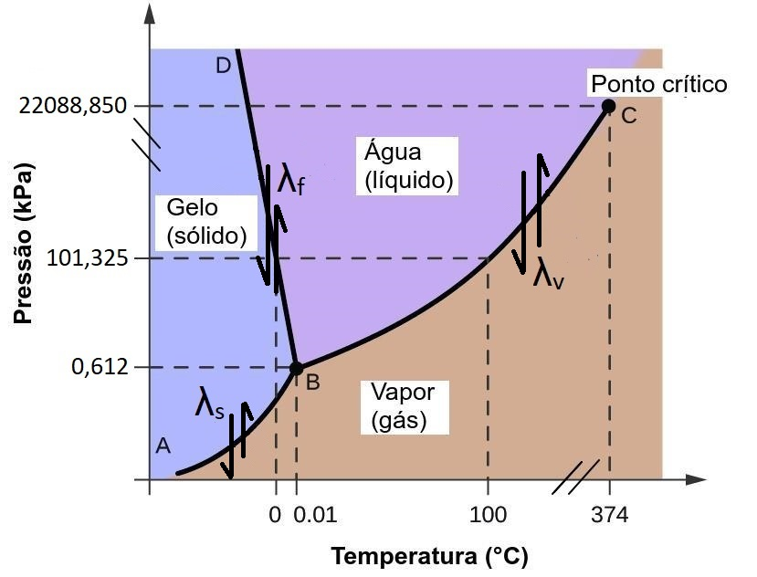

(\#fig:CH-diag-fases-agua)(ref:CH-diag-fases-agua)

<!-- 
refs
https://cnx.org/contents/oFoO44pW@5/Phase-Diagrams 
https://en.wikipedia.org/wiki/Properties_of_water
https://pt.khanacademy.org/science/biology/water-acids-and-bases/hydrogen-bonding-in-water/a/hydrogen-bonding-in-water
https://bodell.mtchs.org/OnlineBio/BIOCD/text/chapter4/concept4.4.html
https://openstax.org/books/biology-2e/pages/2-2-water
-->

As mudanças de fase da água estão associadas a um absorção/liberação considerável de energia na forma de calor latente. Esta energia não muda a temperatura da água, somente seu estado molecular. Esta é uma das principais razões pelas quais a água e o ciclo hidrológico são de importância primária para o sistema climático.

### Densidade da água

<!-- A maioria das substâncias ao se solidificarem diminuem de volume. Nessas substâncias um aumento de pressão acarreta aumento da temperatura de fusão. Isso ocorre porque o aumento da pressão diminui a separação entre as moléculas e o seu movimento molecular fica mais restrito. 

A água é uma exceção quanto ao ponto de fusão (linha BD na Figura \@ref(fig:CH-diag-fases-agua)).

https://educacao.uol.com.br/disciplinas/fisica/mudancas-de-estado-fisico--a-anomalia-da-agua.htm

http://www.if.ufrgs.br/cref/amees/atmo.html

-->

A menor densidade do gelo (917 kg m^-3^) em comparação a água líquida ($\approx$ 1000 kg m^-3^) (Figura \@ref(fig:CH-dens-agua-gelo)) é devido a maneira como as pontes de Hidrogênio são arranjadas quando água congela. No gelo, as moléculas tendem a se separar mais umas das outras do que na água líquida. Isso significa que a água se expande quando congela (maior de volume, menor densidade).

<!-- A energia interna (energia cinética, movimento térmico molecular) das moléculas diminui com a temperatura, o que implica em uma separação média das moléculas menor. Abaixo de 4°C, este efeito faz com que pontes de H se formem com maior frequência do que se quebrem (energia cinética < energia das ligações de H). -->

(ref:CH-dens-agua-gelo) Densidade da água e do gelo em função da temperatura.

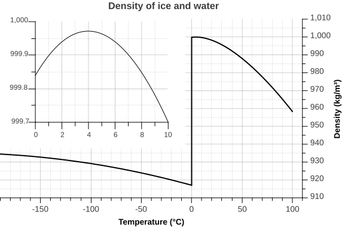

(\#fig:CH-dens-agua-gelo)(ref:CH-dens-agua-gelo)

Esta propriedade especial, explica porque o gelo flutua na superfície dos lagos, ao invés de afundar, o que permite manter a vida aquática em maiores profundidades. Confira a animação na Figura \@ref(fig:pqgeloflutua) para compreender melhor esse comportamento peculiar da água.

(ref:pqgeloflutua) Animação 'Porque o gelo flutua na água?'. Fonte: https://ed.ted.com/lessons/why-does-ice-float-in-water-george-zaidan-and-charles-morton#review.

<!--html_preserve-->

<iframe src="https://www.youtube.com/embed/UukRgqzk-KE" width="533" height="300" frameborder="0" allowfullscreen=""></iframe>

<!--/html_preserve-->

(\#fig:pqgeloflutua)(ref:pqgeloflutua)

Esta propriedade anômala da água também explica porque a temperatura de fusão (linha BD na Figura \@ref(fig:CH-diag-fases-agua)) diminui com o aumento da pressão.

<!-- 
Com a maioria dos outros líquidos, a solidificação—que ocorre quando a temperatura cai e a energia cinética (movimento) das moléculas é reduzida—permite que as moléculas se compactem mais firmemente do que na forma líquida, o que confere ao sólido uma densidade maior do que a do líquido.

Como a polaridade faz a água comportar-se estranhamente 
https://www.youtube.com/watch?v=ASLUY2U1M-8 
-->

### Capacidade térmica

A capacidade térmica é a quantidade de energia necessária para alterar uma dada massa da substância em 1 °C. Para a água, a capacidade de calor específico (cp) em T = 0 °C é 4216 J kg^-1^ K^-1^, praticamente o dobro da solo. Como muitas propriedades da água, isso pode variar com a temperatura, conforme mostrado na Tabela abaixo.

| Temperatura (°C) | Densidade (Kg m^-3^) | Capacidade térmica (J Kg^-1^ K^-1^) |
|------------------|----------------------|-------------------------------------|
| 0                | 999.87               | 4216                                |
| 15               | 999.13               | 4184                                |
| 30               | 9995.67              | 4177                                |

Esta é a maior capacidade de calor específico de qualquer substância conhecida. Então, por que essa propriedade é tão importante ao clima na Terra? O principal efeito é amortecer as mudanças de temperatura. Grande parte da energia solar que entra no topo da atmosfera da Terra atinge a superfície, uma fração significativa da qual é coberta por água. A alta capacidade de calor da água significa que grande parte dessa energia pode ser absorvida com mudanças de temperatura relativamente pequenas. Um planeta sem água aqueceria muito mais significativamente com a mesma entrada de energia. Este efeito também pode ser visto em padrões climáticos regionais. As áreas costeiras perto de grandes corpos d'água geralmente têm um clima mais ameno (isto é, baixa amplitude térmica diária) em comparação com as do interior, devido à capacidade de moderação do corpo d'água. Em outro exemplo, o corpo humano aproveita a alta capacidade de calor da água para regular a temperatura do corpo dentro da pequena faixa necessária para o funcionamento saudável.

<!-- https://open.oregonstate.education/climatechange/chapter/processes/ -->

<!-- Moderação da temperatura Se você já queimou o dedo em uma panela de metal enquanto esperava a água ferver, você sabe que a água aquece muito mais lentamente do que o metal. Na verdade, por causa das ligações de hidrogênio, a água tem uma capacidade melhor de resistir às mudanças de temperatura do que a maioria das outras substâncias. Para entender por quê, primeiro é útil saber um pouco sobre energia e temperatura. A energia térmica é a quantidade total de energia associada ao movimento aleatório de átomos e moléculas em uma amostra de matéria. A temperatura é uma medida da energia média do movimento aleatório das partículas de uma substância. Quando duas substâncias diferem em temperatura, a energia térmica na forma de calor é transferida da substância mais quente para a mais fria. -->

<!-- Quando você aquece uma substância - como uma panela de metal ou água - sua temperatura aumenta porque suas moléculas se movem mais rápido. Mas, na água, parte da energia térmica absorvida quebra as ligações de hidrogênio. Isso não acontece na panela de metal, que não tem ligações de hidrogênio. Como resultado, a água absorve a mesma quantidade de energia térmica, mas sofre menos mudança de temperatura do que o metal. Por outro lado, quando você resfria uma substância, as moléculas desaceleram e a temperatura cai. Mas, à medida que a água esfria, ela forma ligações de hidrogênio. Isso libera energia térmica na forma de calor, portanto, há menos queda na temperatura do que no metal. -->

<!-- Um resultado dessa propriedade é que ela faz com que oceanos e grandes lagos moderem as temperaturas de áreas terrestres próximas. Em outras palavras, as áreas costeiras geralmente têm temperaturas menos extremas do que as áreas do interior. Por exemplo, um grande lago pode armazenar uma grande quantidade de energia térmica do sol durante o dia. Então, à noite, o calor liberado pelo resfriamento gradual da água modera o resfriamento mais rápido do ar e da terra. -->

### Calor latente

No diagrama de fases vimos que energia é necessária para derreter gelo e evaporar água. Esta energia não muda com a temperatura da água, mas sim seu o estado molecular. Por isto essa energia é chamada **calor latente**. Ela fica armazenada nas moléculas de água e é liberada no processo reverso, como por exemplo, quando o vapor d'água condensa para forma líquida.

<!-- Outro conjunto chave de propriedades da água são os chamados calores latentes associados à transformação de fase. Embora a capacidade de calor seja a energia necessária para alterar a temperatura de uma determinada substância (ou seja, água líquida), os aquecimentos latentes são a energia associada a uma mudança de fase de temperatura constante (isotérmica). -->

O calor latente de vaporização (Lv) é a energia consumida na transformação de água líquida em vapor d'água (ou liberada na conversão de vapor em líquido) e tem um valor (em T = 0 ° C) de Lv = 2,5 × 106 J kg^-1^ . Esta propriedade tem leve
variação com a temperatura (por exemplo, é igual a 2,25 x 106 J kg^-1^ a 100° C), mas para a maioria das aplicações, podemos usar este valor nominal. 

O calor latente de fusão (Lf) é a energia consumida na transformação de água sólida (gelo) em água líquida (ou liberada na conversão de líquido em gelo) e tem um valor nominal de Lf = 3,34 × 105 J kg^-1^. Observe que isso é quase uma ordem de magnitude menor que o calor latente de vaporização. 

O calor latente de sublimação (Ls) é a energia consumida na transformação do gelo em vapor d'água (ou liberada na conversão do vapor em sólido) e possui um valor nominal de Ls = 2,85 × 106 J kg^-1^. 

As grandes quantidades de energia necessárias para quebrar as ligações de hidrogênio entre as moléculas de água tornam essas propriedades muito maiores em comparação com outras substâncias. O fato de esses calores latentes serem tão grandes para a água, aliado ao fato de as transformações de fase serem bastante comuns no sistema terrestre, resultam em fontes e sumidores de energia significativas para ciclo hidrológico. Especificamente, o calor latente é crítico na transferência de energia entre a superfície e a atmosfera e no transporte global de calor.

<!-- A água também modera a temperatura por meio da evaporação, como quando você transpira. A evaporação ocorre quando as moléculas na superfície de um líquido escapam para o ar. Conforme as moléculas de água evaporam, o líquido restante fica mais frio. O processo de evaporação requer energia térmica para quebrar as ligações de hidrogênio e liberar as moléculas de água no ar. Na transpiração, essa energia é absorvida pela pele, resfriando o corpo. -->

<!---
Os oceanos armazenam e transportam calor, redistribuindo o aquecimento geograficamente desigual da Terra pelo Sol. O armazenamento de carbono nos oceanos regula a concentração do CO~2~ atmosférico. O vapor d'água é o gás de efeito estufa mais importante em termos de concentração e [aquecimento radiativo](https://en.wikipedia.org/wiki/Radiative_forcing). O vapor d'água condensa para formar nuvens. Aproximadamente 60% da Terra está sempre coberta por nuvens [@Rossow1993]. As nuvens podem gerar precipitação e também afetar o balanço global de radiação refletindo radiação solar, absorvendo e emitindo radiação de onda longa. O calor latente liberado durante a condensação fornece considerável energia para abastecer as tempestades. 

A circulação contínua da água em suas diferentes fases entre a atmosfera, o oceano e a superfície continental regula a quantidade de vapor d'água no ar.

As taxas de precipitação e evaporação dependem da temperatura do ar e de outros fatores climáticos de forma que, quando o clima muda, a quantidade de vapor d'água na atmosfera também muda.

A Evaporação é processo físico pelo qual a água líquida nos oceanos ou no continente muda para vapor no ar. Isto ocorre quando o ar não saturado entra em contato com uma superfície úmida. A evaporação fornece umidade para atmosfera que retorna para a superfície como chuva ou neve. A Evaporação também consome uma grande quantidade de calor, o que ajuda a resfriar a superfície evaporante. 

O vapor d'água na atmosfera, pode condensar formando nuvens e dependendo das condições atmosféricas essa água pode retornar a superfície como precipitação. Quando o vapor d’água condensa na atmosfera é liberado calor. Esse calor é uma importante fonte de energia para a circulação atmosférica e as tempestades.

O balanço de energia global é fortemente influenciado pela alta capacidade da água armazenar energia térmica e pela grande quantidade de energia requerida para sua mudança de fase. A abundância de água na atmosfera e oceanos exerce um importante papel como regulador do clima, sendo o vapor d’água um dos mais importantes gases-estufa.

Os recursos hídricos foram sempre considerados como ilimitados, entretanto o século vinte testemunhou um grande crescimento no uso da água, assim como um aumento no risco de sua contaminação. Está previsto que a população global irá dobrar de valor nos próximos 50 anos, o que causará uma pressão maior sobre os recursos hídricos. 

Diante dos cenários de mudanças climáticas projetados deve ocorrer uma intensificação do ciclo hidrológico evidenciada pelo aumento da variabilidade da precipitação (maior freqüência de eventos extremos e estiagens), o que ressalta ainda mais a importância de um planejamento do uso dos recursos hídricos desde já. Estimativas recentes sugerem que as mudanças climáticas quantificarão por um aumento de 20 % na escassez de água global.

## Questão da escala
#O ciclo da água no sistema terrestre e sua variabilidade na escala global, regional e local são influenciados por uma variedade de processos, interações mútuas, mecanismos de *feedback* e processos antropogênicos. As escalas em que esses processos interagem espacial e temporalmente variam para cada componente do sistema terrestre (atmosfera, hidrosfera, criosfera e biosfera) de uma forma complexa.

#  "And here's to you, Mrs. Robinson, Jesus loves you more than you will know."
# 
# ENFASE COM COR FNS 
# 
#  

#  <a href="/donate">DONATE</a>
#  

https://scied.ucar.edu/learning-zone/water-cycle
-->

<!-- 
# outras propriedades importantes para água no solo 

https://pt.khanacademy.org/science/biology/water-acids-and-bases/cohesion-and-adhesion/a/cohesion-and-adhesion-in-water 
-->

## Balanço Hídrico {#balhid}

O ponto inicial da maioria das análises hidrometoerológicas envolvem a aplicação do balanço de massa. A equação do balanço de massa para um dado sistema pode ser derivada a partir do teorema do Transporte de Reynolds  [@Mays2005]. 

O teorema inicia com a definição de um volume de controle no espaço, definido por uma superfície  de controle (Figura \@ref(fig:volcontrol)).

(ref:volcontrol) Esquema básico de um volume de controle com fluxos através da superfície de controle.

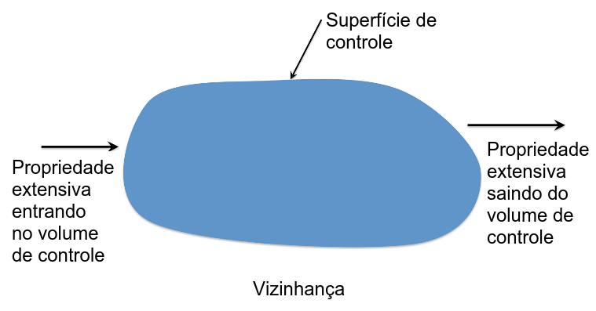

(\#fig:volcontrol)(ref:volcontrol)

Propriedades de um fluído podem ser extensivas ou intensivas. As extensivas são aquelas relacionadas de alguma forma à massa total do sistema, incluindo a massa ($m$), *momentum* ($m \vec{V}$) e energia ($E$). Propriedades intensivas são aquelas geralmente normalizadas pela massa (ex.: *momentum* por unidade de massa, ou seja, velocidade; energia por unidade de massa, etc). Uma propriedade extensiva pode ser representada por $\mathbf{B}$ e um intensiva como $B$ ($\frac{d\mathbf{B}}{dt}$). A equação geral para o volume de controle pode ser expressa como [@Mays2005]:

\begin{equation} 
  \frac{d\mathbf{B}}{dt} = \frac{d}{dt}\int_{VC} \rho\;B\;dV +\int_{CS}\rho\;B\mathbf{V}\cdot d\mathbf{A}
  (\#eq:vol-control-int)
\end{equation}

onde os termos individuais são:

$\frac{d\mathbf{B}}{dt} \equiv$ taxa total de variação da propriedade extensiva

$\frac{d}{dt}\int_{VC} \rho\;B\;dV \equiv$ taxa de variação da propriedade extensiva no volume de controle (onde $\rho$ é a densidade do fluido e $dV$ é um volume diferencial)

$\int_{CS}\rho\;B\mathbf{V}\cdot d\mathbf{A}$ taxa liquida do fluxo através da superfície de controle (onde $\mathbf{V}$ é a velocidade e $dA$ é a área diferencial da superfície do controle)

A equação do balanço de massa (ou continuidade) é derivada do teorema do transporte de Reynolds definindo $\mathbf{B}$ como massa (fazendo $B = 1$) e portanto o termo do lado esquerdo da equação é igual a zero, o que leva a:

\begin{equation} 
  \frac{d}{dt}\int_{VC} \rho\;dV = \frac{dM}{dt}= -\int_{SC}\rho\mathbf{V}\:d\mathbf{A}
  (\#eq:mass-bal-int)
\end{equation}

a qual expressa que a taxa de variação do armazenamento de massa no volume de controle (massa/tempo) é balanceado pela taxa líquida do fluxo de massa através da superfície de controle. Diversas suposições podem simplificar a equação \@ref(eq:mass-bal-int), incluindo densidade constante (apropriada no caso do escoamento de água líquida e problemas de armazenamento), nesse caso:

\begin{equation}
  \frac{d}{dt}\int_{VC} dV = -\int_{SC}\mathbf{V}\cdot d\mathbf{A}
  (\#eq:contin1)
\end{equation}

a qual pode ser simplesmente escrita como:

\begin{equation}
  \frac{dS}{dt} = \sum_{i}{I_{i}} - \sum_{i}{O_{i}}
  (\#eq:contin2)
\end{equation}

onde $S$ é o volume de armazenamento e o lado direito é o soma das entradas ($I_i$) menos a soma das saída ($O_i$) em termos de fluxo volumétrico  através da superfície do volume de controle. Um ponto-chave é que apenas fluxos através do
superfície de controle precisam ser considerada no balanço de massa equação. Fluxos internos não contribuem para mudanças no armazenamento de massa/volume. Este fato é frequentemente usado na construção de um volume de controle para eliminar fluxos que são desconhecidos tornando-os fluxos internos. Portanto, para aplicar a equação adequadamente, um volume de controle deve ser definido explicitamente. Outro simplificação bastante usada é a de estado estacionário, situação em que o termo de armazenamento é igual a zero, produzindo:

\begin{equation}
  \sum_{i}{I_{i}} = \sum_{i}{O_{i}}
  (\#eq:estac)
\end{equation}

No contexto de aplicações do balanço massa (ou outras), várias formas de fluxos são usadas​e é importante diferenciá-los, assim como suas unidades. Fluxos de massa (ou seja, usados​na equação \@ref(eq:vol-control-int)) têm unidades de
massa/tempo (por exemplo, kg s^-1^). Fluxos volumétricos (ou seja, usados​na Equação
\@ref(eq:estac) têm unidades de volume/tempo (por exemplo, m^3^ s^-1^). Para converter entre os dois, a densidade do fluido pode ser usada, ou seja, para
água:

$$\frac{kg}{s} \times \frac{1}{\rho} = \frac{m^{3}}{s}; \rho = 1000\:   kg\:  m^{-3}$$

Muitas vezes, a densidade de fluxo é usada no lugar do fluxo, que é simplesmente, ou o fluxo de massa ou volumétrico, normalizado pela área da seção transversal apropriada, através da qual o fluxo está ocorrendo, ou seja

$$Massa: \frac{kg}{s} \times \frac{1}{A} \rightarrow \frac{kg}{m^{2}s}$$

$$Volume: \frac{m^{3}}{s} \times \frac{1}{A} \rightarrow \frac{m}{s} ou \left ( \frac{mm}{dia}, \: \frac{m}{ano} \right )$$

onde, como mostrado acima, se a densidade do fluxo de massa for conhecida, a densidade de fluxo volumétrico pode ser obtida dividindo-se pela
densidade da água. A densidade de fluxo volumétrica é uma forma comum de expressar fluxos em hidrometeorologia. Por exemplo, a precipitação média anual em Santa Maria é 1100 mm ano^-1^, que está
implícito ocorrer sobre uma determinada área. Para obter o fluxo volumétrico real seria necessário multiplicar pela área da superfície de Santa Maria-RS, sobre a qual a densidade de fluxo ocorre.

Como será discutido em mais detalhes posteriormente, os fluxos de água e energia são diretamente relacionados. O exemplo mais relevante é que o fluxo de evaporação está diretamente ligado ao fluxo de calor associado a mudança de fase.
Por exemplo, o fluxo de calor latente, associado à mudança de fase é simplesmente a densidade de fluxo de massa multiplicada pelo calor latente de vaporização: 

$$Fluxo\: de\: energia = \lambda_{v} \times Fluxo\: de\: massa; \lambda_{v} = 2,5 \times 10^6\: J\: kg^{-1}$$

onde as unidades de W m^-2^ são as mais comumente usadas para fluxos de energia (na verdade, densidades de fluxo) em hidrometeorologia.

### Balanço Hídrico Global {#BHglobal}

Para termos uma melhor noção dasescalas de tempo dos fluxos hidrológicos e do balanço de massa, é instrutivo começar na escala global. Se considerarmos um volume de controle cobrindo toda a superfície do globo (Figura \@ref(fig:balan-global)), os fluxos relevantes através da superfície de controle são a precipitação e a evapotranspiração no continente e no oceano. Note que o escoamento entre o continente e o oceano é um fluxo interno e, portanto, não é relevante para o balanço de massa do volume de controle que escolhemos (retângulo vermelho). O balanço global instantâneo de massa (ou de volume) pode então ser escrito como:

\begin{equation}
  \frac{dS}{dt} = P_{con} - ET_{con} + P_{oce} - ET_{oce}
  (\#eq:balmassglob)
\end{equation}

<!-- Equação \@ref(eq:balmassglob) -->

onde S representa a massa ou volume armazenado nos reservatórios de água do oceano e continente com unidades consistentes (em termos de massa ou volume). Dada a equação acima, se todos os fluxos instantâneos forem conhecidos, então a variação do armazenamento pode ser determinada. Alternativamente, se a variação de armazenamento for conhecida e todos os fluxos, exceto um, forem conhecidos, a equação pode ser usada para resolver o fluxo desconhecido como resíduo da Equação \@ref(eq:balmassglob).

Na prática, os termos do balanço de massa instantâneo são difíceis, senão impossíveis, de se estimar com precisão (especialmente em grandes escalas). Portanto, para simplificar a análise hidrológica, muitas vezes usamos a **média de longo prazo** da equação de balanço de massa acima, onde podemos usar o operador de média de tempo:

\begin{equation}
 \bar{X} = \frac{1}{T}\int_{t}^{t+T} X \, dt
  (\#eq:medtemp)
\end{equation}

onde T é um intervalo temporal e a equação acima pode ser aplicada a cada termo na equação de balanço de massa:

\begin{equation}
  \bar{\frac{dS}{dt}} = \bar{P}_{con} - \bar{ET}_{con} + \bar{P}_{oce} - \bar{ET}_{oce}
  (\#eq:bmassglobmed)
\end{equation}

A questão então é: se o período de média for longo o suficiente, podemos dizer algo sobre qualquer um desses termos? No longo prazo, podemos dizer razoavelmente que a variação (média) do armazenamento deve ser próxima de zero ou pelo menos muito menor do que os fluxos médios. Isso implicitamente assume alguma estacionariedade no sistema (ou seja, é um estado estacionário no longo prazo). Em geral, quanto mais longo for o período da média, mais precisa será a suposição. No mínimo um ano deve ser usado para Obter a média ao longo do ciclo sazonal (ou seja, a maioria das regiões tem uma estação chuvosa onde o armazenamento de água aumenta e uma estação seca onde ele dimuninui). Qualquer período menor seria considerado uma violação da suposição de estado estacionário.

Tirando a média de longo prazo resulta em:

\begin{equation}
  \bar{\frac{dS}{dt}} \approx 0 = \bar{P}_{con} - \bar{ET}_{con} + \bar{P}_{oce} - \bar{ET}_{oce} = \bar{P}_{glob} - \bar{ET}_{glob}
  (\#eq:bmassglobestac)
\end{equation}

   

\begin{equation}
  \rightarrow \bar{P}_{glob} = \bar{ET}_{glob}
  (\#eq:bmassglobestac2)
\end{equation}

o que deveria fazer sentido porque, se esses fluxos não estivessem em equilíbrio, a água estaria se acumulando a longo prazo na atmosfera (se a evapotranspiração excedesse a precipitação) ou no continente/oceano (se a precipitação excedesse a evapotranspiração). A partir dos dados, estima-se que:

$$\bar{P}_{glob} = \bar{ET}_{glob} \approx 953\: mm\: ano^{-1}$$

onde esse valor está expresso em termos de uma densidade de fluxo volumétrico (ou seja, normalizado pela superfície da Terra). Em fluxo volumétrico, seria igual a 1332 km^3^ dia^-1^. Podemos pensar neste fluxo como a taxa média global do ciclo hidrológico. Em outras palavras, esta é a quantidade média de água que se move através dos vários reservatórios hidrológicos. Observe que os fluxos instantâneos em qualquer ponto e tempo podem ser muito diferente (como será discutido mais tarde). 

\BeginKnitrBlock{rmdnote}
Um conceito útil envolvendo o tamanho dos reservatórios e os fluxos entre eles é o Tempo de Residência $T_{r}$. O $T_{r}$ [T] é uma medida de quanto tempo, em mmédia, uma molécula de água gasta dentro reservatório antes de mover-se para outro reservatório do Ciclo Hidrológico. O $T_{r}$ é facilmente calculado para **sistemas estacionários**, ou seja quando o fluxo de entrada e saída são idênticos:

$$T_{r} = \frac{V}{F} \; \left [ \frac{L^{3}}{L^{3}.T^{-1}} \right ]$$

O $T_{r}$ fornece um indicação do tempo necessário para substituir toda água do reservatório. A água nos oceanos tem um tempo de residência de $\approx$ 2600 anos, enquanto o da água dos rios, lagos e áreas úmidas é de  $\approx$ 134 dias. O $T_{r}$ água na atmosfera é de somente $\approx$ 10 dias, ou seja, um dos reservatórios mais dinâmicos do ciclo hidrológico e contribui muito para a variabilidade do sistema. 

A determinação do $T_{r}$ dos oceanos é complicada pelo fato há uma camada relativamente rasa (da ordem de 100 m de profundidade) que interage prontamente com os reservatórios atmosfericos e terrestres, mas esta camada está sobre uma camada muito mais profunda e isolada de água salina que move-se lentamente.
\EndKnitrBlock{rmdnote}

Dada esta taxa, podemos estimar o tempo médio de residência nos vários reservatórios. Com as estimativas dos volumes dos reservatórios 
(Tabela \@ref(tab:water-earth-table)), os tempos de residência podem ser estimados e são mostrados na Tabela \@ref(tab:water-earth-table2). 

Table: (\#tab:water-earth-table2)Estimativas dos tempo de residência nos principais reservatórios hidrológicos globais. Estes valores assumem uma taxa média global de fluxo hidrológico de 1332 km^3^ dia^-1^. Adaptado de @Trenberth2007.

|Reservatório               | Volume (Km^3^)| Tempo de residência|unidade |
|:--------------------------|--------------:|-------------------:|:-------|
|Oceano                     |  1.335.040.000|               2.746|anos    |
|Áreas congeladas           |     26.372.000|                  NA|anos    |
|Água subterrânea           |     15.300.000|                  31|anos    |
|Lagos, Rios e áreas úmidas |        178.000|                 134|dias    |
|Água no solo               |        122.000|                  92|dias    |
|Atmosfera                  |         12.700|                  10|dias    |

É muito importante ter em mente que os números acima  são médias globais de longo prazo. Variabilidade significativa existe na maioria dos fluxos hidrológicos, tanto no espaço quanto no tempo.

Na verdade, é justamente essa variabilidade que deve ser acomodada por projetos de sistemas hídricos. Alguns exemplos interessantes para
ilustrar a variabilidade espacial, incluem os lugares mais secos e mais úmidos da Terra. Para ilustração, podemos comparar a precipitação média de longo prazo como
uma medida representativa da hidrologia local. Por exemplo, Los Angeles recebe uma média de 380 mm ano^-1^, tornando-a um local relativamente seco. No entanto, o lugar mais seco da Terra é o Deserto do Atacama, no Chile. Em partes do Atacama nunca houve foi registrado chuva, e sobre todo o deserto, a média das chuvas é menos de 1 mm ano^-1^! A falta de água contribui para um
paisagem particularmente rígida com pouca ou nenhuma vida, ao ponto
que muitas vezes é comparada à superfície de Marte.

Em contraste, o lugar "mais úmido" da Terra é geralmente
considerado Cherrapunji, Índia, que recebe uma precipitação média anual de 11100 mm ano^-1^. Além disso, devido ao clima de monções, a maior parte dessa chuva ocorre na estação chuvosa que dura de 3 a 6 meses. Tendo em mente que esta é a média de longo prazo, outro exemplo interessante é a precipitação máxima anual observada em Cherrapunji, que foi de 26500 mm! Esses dois exemplos fornecem extremidades interessantes do espectro hidrológico, onde em um a água é extremamente escassa, tornando o abastecimento hídrico um problema crítico. No outro, o excesso de água causa problemas extremos de inundação. Além desses dois
exemplos de extrema variabilidade espacial hidrológica, é
importante ter em mente a variabilidade temporal. Por
exemplo, a maior parte dos 380 mm anuais de precipitação em Los Angeles ocorre no inverno (dezembro-março), que contrasta com Cherrapunji, que recebe quase toda chuva durante o verão. Ao fazer qualquer análise hidrológica, é importante
definir claramente as escalas espaciais e temporais relevantes de
interesse.

### Análise quantitativa dos fluxos hidrológicos globais 

<!-- A partição da água entre as componentes do ciclo hidrológico para o sistema terrestre global constitui o balanço hídrico global (Figura \@ref(fig:balan-global)). A quantidade de água e sua transferência pode ser medida em termos de volume (m^3^), profundidade (m), massa ou mols (mol) por unidade de área. Essas grandezas são relacionadas pela densidade da água (1 m^3^ H~2~O = 1000 kg) e pela massa molecular da água (1 mol H~2~O = 18 g). Um kg de água espalhado sobre uma área  de m^2^ é equivalente a profundidade de 1 mm, um volume de 0,001 m^3^ e 55,6 mol m^-2^. -->

(ref:balan-global) Principais fluxos do ciclo hidrológico global. Os valores estão expressos em unidades relativas à Precipitação média anual nos continentes (100 u.r. = 119.000 km^3^). Setas pretas indicam fluxos para a atmosfera, setas cinzas indicar setas para o oceano ou continente e setas azuis idicam fluxos laterais. Adaptado de Maidment (1993).

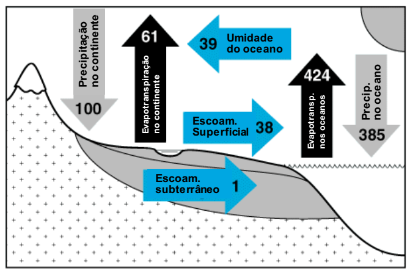

(\#fig:balan-global)(ref:balan-global)

Anualmente, $\approx$ 577150 km^3^ ano^-1^ de água (o que equivale[^6] a 1132 mm), deixam a atmosfera na forma de Precipitação. A mesma quantidade retorna para atmosfera anualmente como Evaporação, por isso a quantidade de água na atmosfera não muda com o tempo e o ciclo hidrológico na escala global é fechado.

[^6]: Note que os fluxos podem ser expressos em lâmina de água equivalente, dividindo-se o volume pelas [áreas consideradas](https://en.wikipedia.org/wiki/Earth) (Área da superfície da Terra = 510072000 km^2^, Área da superfície continental = 148940000 km^2^, Área da superfície oceânica = 361132000 km^2^). 

A água não é uniformemente distribuída entre os continentes e o oceano. A Precipitação média nos continente é 119000 km^3^ (cerca de 21% da Precipitação média global. Tomando este valor como unidade relativa (u.r) para os demais fluxos do balanço hídrico global (100 u.r = 119.000 km^3^), 61% desta precipitação (487 mm) evapora de volta para atmosfera. 

Nos oceanos a evaporação supera a precipitação, resultando em uma diferença de -39 u.r. Este excedente de evaporação dos oceanos ($\approx$ 9%) é transportado pelo vento para os continente e contribui para  precipitação nos continentes[^9]. No continente a precipitação excede a evapotranspiração gerando um excesso (39 u.r, ou 312 mm) que escoa em grande parte pela superfície e o subsolo para o oceano, reestabelecendo a maior perda de água por evaporação no oceano. 

[^9]: Se esta fosse a única fonte de precipitação a média global da precipitação seria somente cerca de 233 mm, um valor típico de regiões semi-áridas e desertos.

O *runnof* total estimado é equivalente a 39% da precipitação continental, portanto um coeficiente de escoamento de 0,39. Esta quantidade representa o que é chamado convencionalmente de recursos hídricos renováveis. Mas nem toda esta quantidade é acessível para uso humano, porque parte da água escoa para rios remotos e parte da água das enchentes sazonais não podem ser capturadas antes de atingir os oceanos. De acordo com a FAO (2003), 9.000-14.000 km^3^ (20-31% dos recursos hídricos renováveis) é o total de água economicamente disponível para o uso humano. 

### Balanço Hídrico Atmosférico

<!-- 
menor escala, mais aberto o ciclo 
-->

#### Água precipitável

Figura \@ref(fig:clima-agua-precip).

(ref:clima-agua-precip) Climatologia da água precipitável. Fonte: [climvis](http://climvis.org/anim/maps/global/pwat.html)

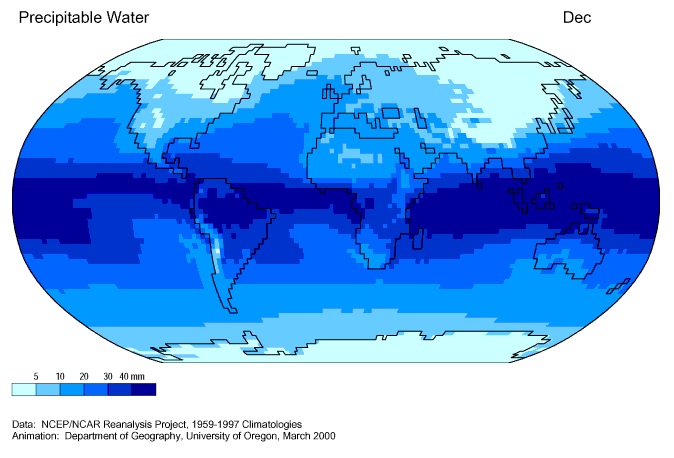

(\#fig:clima-agua-precip)(ref:clima-agua-precip)

Divergência horizontal do fluxo de vapor d'água integrado na vertical.

Figura \@ref(fig:div-hor-vapor).

(ref:div-hor-vapor) Climatologia anual da Divergência horizontal do transporte de vapor d'água integrado na atmosfera. Fonte: @Peixoto1992.

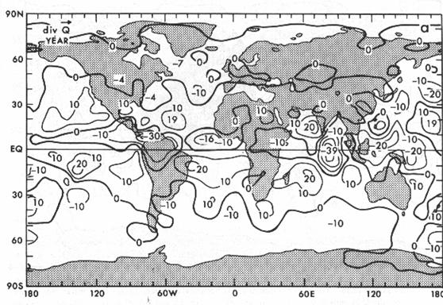

(\#fig:div-hor-vapor)(ref:div-hor-vapor)

## Bacia Hidrográfica

Para compreender melhor os processo hidrológicos é necessário definir um volume 
de controle mais apropriado do que áreas continentais ou politicamente definidas. 
A maior parte dos problemas hidrológicos requerem volumes de controle de escala 
muito inferior a continental. A equação do balanço hídrico é aplicada a uma 
região geográfica, topograficamente definida, para estabelecer as 
características hidrológicas da região. Esta região é chamada de 
Bacia Hidrográfica (BH).

A BH é limitada ao longo de sua borda por pontos mais altos do relevo, chamados Dividores de Água – morros, serras ou montanhas; abaixo por rocha e acima pela atmosfera. Uma Bacia Hidrográfica, em geral, possui muitas nascentes, mas uma saída única, o rio principal[^8], responsável pelo escoamento da água captada.

[^8]: Rio de maior extensão na rede de drenagem da BH.

Uma gota de água no lado da encosta direcionada para o rio escoa na direção do rio. A gota de água no outro lado do divisor escoa para outro rio (veja animação abaixo).

 <html>
<head>
  <title>Flash animations made by the R2SWF package</title>
</head>
<body>

 <embed width="480" height="480" name="plugin" src="images/2-basin_defined.swf" type="application/x-shockwave-flash"> 

</body>
</html>
 

Fonte: [COMET website](http://meted.ucar.edu/) UCAR, NOAA.

\BeginKnitrBlock{rmdnote}
Bacia Hidrográfica (BH): Área de captação natural sobre a superfície terrestre que faz convergir os escoamentos para uma seção transversal de um rio (Figura \@ref(fig:secao-transv)). A Bacia Hidrográfica é constituída de um conjunto de superfícies vertentes (encostas) e uma rede de drenagem formada por cursos d'água que confluem até resultar em um leito único no exutório.

A BH é definida a partir de uma localização específica, geralmente ao longo de um curso d'água e a área terrestre associada pode ser considerada **captar** a água que escoa pelo ponto exutório. Este ponto define a delimitação de uma BH e é para onde toda precipitação captada à montante converge por escoamento superficial e sub-superficial. 

A BH pode ser vista como uma unidade natural da paisagem que integra o escoamento da água durante a fase terrestre do ciclo hidrológico.
\EndKnitrBlock{rmdnote}

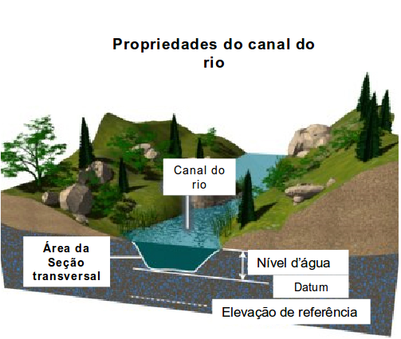

(\#fig:secao-transv)Seção transversal de rio.

A localização da seção transversal (Figura \@ref(fig:secao-transv)) do ponto exutório é determinada pela proposta da análise. Em geral, as BH são delineadas a partir de estações fluviométricas (onde a vazão é medida) ou acima de uma junção com um rio maior, um lago, um reservatório, uma usina hidrelétrica ou um oceano. A região localizada acima deste ponto, ou seja, no sentido contra a corrente do rio, é chamada Montante. A região abaixo deste ponto, no sentido da corrente do rio, é denominada Jusante. 

Existe um número infinito de pontos ao longo do rio, então é possível definir inúmeras BH para um rio específico (Figura \@ref(fig:nested-basins)). A água escoa morro abaixo até um arroio mais próximo, onde aquela água escoará para um rio à jusante através da Rede de Drenagem. Rios tributários menores deságuam em outros rios maiores que em última instância vão desaguar no oceano. A Rede de Drenagem é a organização dos padrões de drenagem sobre a paisagem da BH. BHs de montante são aninhadas à BHs de jusante e são chamadas sub-bacias hidrográficas. Esta hierarquia pode ter diferentes níveis de acordo com a BH. Em geral, são definidos pelo menos 3 níveis, de acordo com a escala espacial: Bacias Hidrográficas, Sub-bacias Hirográficas e Micro-Bacias Hidrográficas.

(ref:nested-basins) Hierarquia de Bacias Hidrográficas aninhadas. Fonte: @Marsh1987.

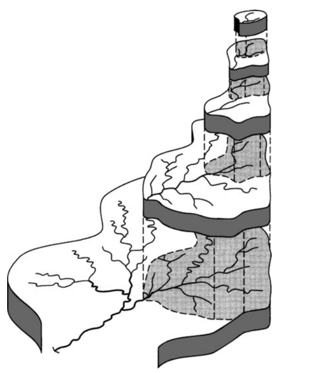

(\#fig:nested-basins)(ref:nested-basins)

A projeção horizontal da área da BH é chamada Área de Drenagem e inclui toda superfície à montante do exutório. Embora as divisões políticas, em geral, não sigam os limites das BH, agências de planejamento dos recursos hídricos e do uso da terra reconhecem que a gestão efetiva da qualidade e quantidade da água requer a perspectiva da BH.

### Bacia Hidrográfica efetiva

As linhas reais dos divisores de água podem não necessariamente coincidirem com o divisor da drenagem sobre a superfície. A Figura \@ref(fig:bacia-efetiva) mostra um exemplo desta situação. Nesta caso, um substrato impermeável está abaixo de uma camada permeável. A diferença entre as BH efetiva e topográfica é particularmente notável em terrenos constituídos de rocha calcária (ou [terreno cárstico](https://pt.wikipedia.org/wiki/Carste)). 

A BH efetiva deve incluir os limites subterrâneos do sistema o que depende das condições geológicas que controlam o movimento da água subterrânea. 

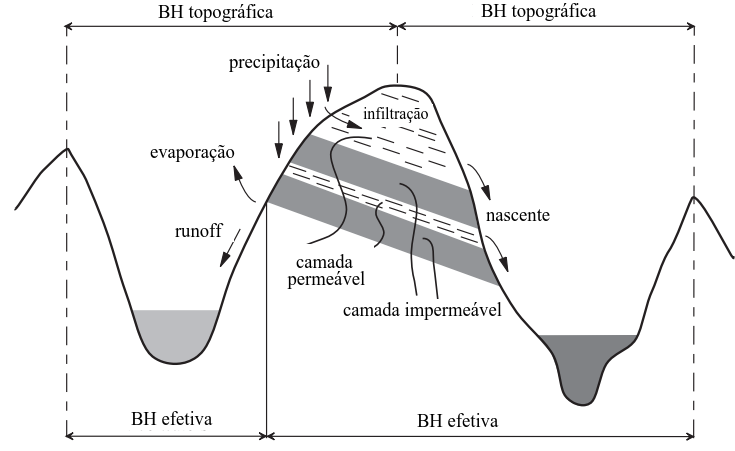

(\#fig:bacia-efetiva)Distinção entre BH topográfica e BH efetiva. Fonte: Adaptado de http://echo2.epfl.ch/e-drologie/chapitres/chapitre2/chapitre2.html.

Este exemplo ilustra uma limitação do conceito de BH topográfica que pode ajudar a explicar situações em que a aplicação do balanço hídrico à uma BH definida baseada somente na topografia pode gerar resultados inconsistentes.

Outra limitação do modelo de BH topográfica é que fatores antropogênicos não são considerados, tais como barreiras formadas por estradas, ou captação, ou transposição de água por mecanismos artificiais, sistemas de drenagem, bombeamento subterrâneo que alteram o balanço hídrico da BH (Figura \@ref(fig:bacia-modif)).

(ref:bacia-modif) Exemplos de modificações da área de drenagem da BH por fatores antropogênicos. Esquerda: Transferência de água do canal natural para uso privado. Direita: BH com estrada alterando as trajetórias do escomaneto superficial natural. Fonte: adaptado de http://echo2.epfl.ch/e-drologie/chapitres/chapitre2/chapitre2.html.

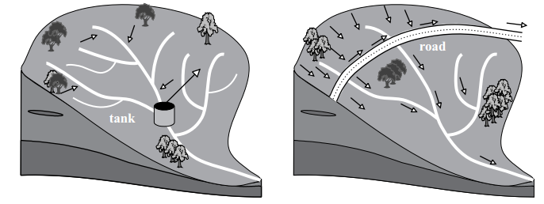

(\#fig:bacia-modif)(ref:bacia-modif)

### Delimitação da Bacia Hidrográfica

## Processos Hidrológicos

Termos do runoff

 <html>
<head>
  <title>Flash animations made by the R2SWF package</title>
</head>
<body>

 <embed width="480" height="480" name="plugin" src="images/infilt_runoff.swf" type="application/x-shockwave-flash"> 

</body>
</html>
 

### Infiltração

asd

 <html>
<head>
  <title>Flash animations made by the R2SWF package</title>
</head>
<body>

 <embed width="480" height="480" name="plugin" src="images/infilt_runoff_generic.swf" type="application/x-shockwave-flash"> 

</body>
</html>
 

prec > F

 <html>
<head>
  <title>Flash animations made by the R2SWF package</title>
</head>
<body>

 <embed width="480" height="480" name="plugin" src="images/infilt_runoff_hvyrain.swf" type="application/x-shockwave-flash"> 

</body>
</html>
 

prec < F

 <html>
<head>
  <title>Flash animations made by the R2SWF package</title>
</head>
<body>

 <embed width="480" height="480" name="plugin" src="images/infilt_runoff_ltrain.swf" type="application/x-shockwave-flash"> 

</body>
</html>
 

### Geração de escoamento superficial

Excesso-infiltração

 <html>
<head>
  <title>Flash animations made by the R2SWF package</title>
</head>
<body>

 <embed width="480" height="480" name="plugin" src="images/infilt_excess_flow.swf" type="application/x-shockwave-flash"> 

</body>
</html>
 

Excesso-saturação

 <html>
<head>
  <title>Flash animations made by the R2SWF package</title>
</head>
<body>

 <embed width="480" height="480" name="plugin" src="images/satur_excess_flow.swf" type="application/x-shockwave-flash"> 

</body>
</html>
 

### Resposta Hidrológica

asd

 <html>
<head>
  <title>Flash animations made by the R2SWF package</title>
</head>
<body>

 <embed width="480" height="480" name="plugin" src="images/infiltration_runoff.swf" type="application/x-shockwave-flash"> 

</body>
</html>
 

cov1

 <html>
<head>
  <title>Flash animations made by the R2SWF package</title>
</head>
<body>

 <embed width="480" height="480" name="plugin" src="images/coverage1.swf" type="application/x-shockwave-flash"> 

</body>
</html>
 

Fonte: [COMET website](http://meted.ucar.edu/) UCAR, NOAA.[^5]

cov2

 <html>
<head>
  <title>Flash animations made by the R2SWF package</title>
</head>
<body>

 <embed width="480" height="480" name="plugin" src="images/coverage2.swf" type="application/x-shockwave-flash"> 

</body>
</html>
 

cov3

 <html>
<head>
  <title>Flash animations made by the R2SWF package</title>
</head>
<body>

 <embed width="480" height="480" name="plugin" src="images/coverage3.swf" type="application/x-shockwave-flash"> 

</body>
</html>
 

 <html>
<head>
  <title>Flash animations made by the R2SWF package</title>
</head>
<body>

 <embed width="480" height="480" name="plugin" src="images/surface_cover.swf" type="application/x-shockwave-flash"> 

</body>
</html>
 

