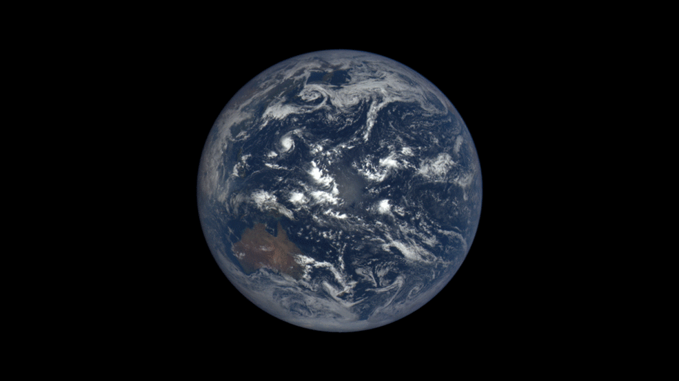

--- 
title: "Hidrometeorologia"
author: "Jônatan Tatsch"
date: "`r Sys.Date()`"
site: bookdown::bookdown_site
output: bookdown::gitbook
documentclass: book
bibliography: [book.bib]
csl: abnt.csl
link-citations: yes
github-repo: lhmet/hidrometeobook
description: "Notas de aula da disciplina de Hidrometeorologia A (FSC1087) do curso de graduação em Meteorologia da UFSM."
header-includes:
   - \usepackage{animate}
---


# Apresentação {-}


```{r, fig.align='center', echo=FALSE, include=identical(knitr:::pandoc_to(), 'html'),out.width='100%'}

output <- knitr::opts_knit$get('rmarkdown.pandoc.to')
#knitr:::pandoc_to()
#latex, html, word, beamer
if(output == "latex"){
 
}

```


Este material é uma composição das notas de aula da disciplina
**Hidrometeorologia A (FSC1087)** do curso de Graduação em [<span style="font-variant:small-caps;">meteorologia</span>](http://w3.ufsm.br/meteorologia/) oferecido no Departamento de Física da Universidade Federal de Santa Maria ([UFSM](http://site.ufsm.br/)). O conteúdo foi designado para os alunos do curso de graduação em Meteorologia, mas pode ser útil para qualquer pessoa que queira conhecer a disciplina de Hidrometeorologia.

O objetivo é prover um material de suporte ao ensino dos conceitos fundamentais da Hidrometeorologia necessários para:

- o entendimento dos processos hidrometeorológicos e sua dinâmica no espaço e tempo; 

- compreender o papel da meteorologia na gestão de recursos hídricos 

- capacitar a previsão dos impactos e riscos nos recursos hídricos devido às mudanças climáticas e atividades humanas.

Ao longo do texto buscou-se dar créditos aos autores das figuras utilizadas. Muitas figuras foram obtidas do programa [COMET (MetEd)](https://www.meted.ucar.edu/). Outras figuras foram obtidas de fontes de domínio público ou das [referências da disciplina](https://ead06.proj.ufsm.br/moodle/pluginfile.php/1504764/mod_resource/content/0/aula-inaugural-2018.pdf). Se alguma figura não conter referência, a informação para correção nas versões futuras é apreciada.

O texto está em formato [html](https://pt.wikipedia.org/wiki/HTML) para tirar o melhor proveito de recursos de multimídia, da capacidade de busca de texto, links para websites. 

```{r, include = FALSE}
#O texto usa a linguagem de programação R [^1] [@R-base] como uma ferramenta pedagógica em exemplos baseados na solução de problemas realísticos. Isto possibilita que os códigos dos exemplos sejam reproduzidos e os resultados visualizados sem quase nenhum conhecimento de R do estudante [^2].

#[^1]: R é uma linguagem de programação intuitiva com um ambiente para análise de dados interativa. E o melhor, é um software gratuito.

#[^2]: Para quem tem um conhecimento elementar de qualquer linguagem de programação, conhecendo um pequeno conjunto de peculiaridades do R, como vetorização e indexação lógica é suficiente para obter uma compreensão básica da maioria dos trechos de código dos exemplos apresentados. Para aprender essas peculiaridades do R você pode consultar o material da disciplina [ADAR](https://lhmet.github.io/adar-ebook/).


```


O texto é organizado em 5 capítulos:

- \@ref(hidromet) Hidrometeorologia

- \@ref(ciclohidro) Ciclo hidrológico

- \@ref(precip) Precipitação

- \@ref(umidsolo) Umidade do solo

- \@ref(evapo) Evapotranspiração


```{r, include=FALSE}
"images/basin_defined.swf"
# automatically create a bib database for R packages
knitr::write_bib(
  c(
    .packages(),
    "base",
    "bookdown",
    "knitr",
    "rmarkdown"
  ),
  "packages.bib"
)
```

```{r, include = FALSE}
# REFS
"/home/hidrometeorologista/Dropbox/books/hidrology/top/Hingray_HydrologyAScienceOfNature/Hydrology_A_ScienceOfNature.pdf"
"/home/hidrometeorologista/Dropbox/books/hidrology/top/Groundwater-Science2012.pdf"
"/home/hidrometeorologista/Dropbox/books/hidrology/top/Hydrology-and-water-resource-systems-analysis-2016.epub"
#"/home/hidrometeorologista/Dropbox/books/interaction_biosphere_atmosphere/ecology/Encyclopedia_of_Ecology.pdf"
# pag. 1957 (Hydrosphere)
"/home/hidrometeorologista/Dropbox/books/hidrology/top/Encyclopedia-of-hydrological-sciences2005.pdf"
"/home/hidrometeorologista/Dropbox/books/hidrology/top/theEarthsHydrologicalCycle_Springer2014_.pdf"
# pag. 7 (Foreword), 11 (Review Underst. Earths Hyd Cycle)
"/home/hidrometeorologista/Dropbox/books/hidrology/top/Margulis_IntroToHydrology/Margulis_Intro_to_Hydrology_2014a_MOD_WET.pdf"
"/home/hidrometeorologista/Dropbox/books/meteorology/Encyclopedia-Atmospheric-Sciences.pdf"
# pag. 1249 (Hydrology)
"/home/hidrometeorologista/Dropbox/books/hidrology/UnderstandingEarth.pdf"
# pag. 402 (Hydrol Cycle)
"/home/hidrometeorologista/Dropbox/books/hidrology/Encyclopedia of Inland Waters"
```


